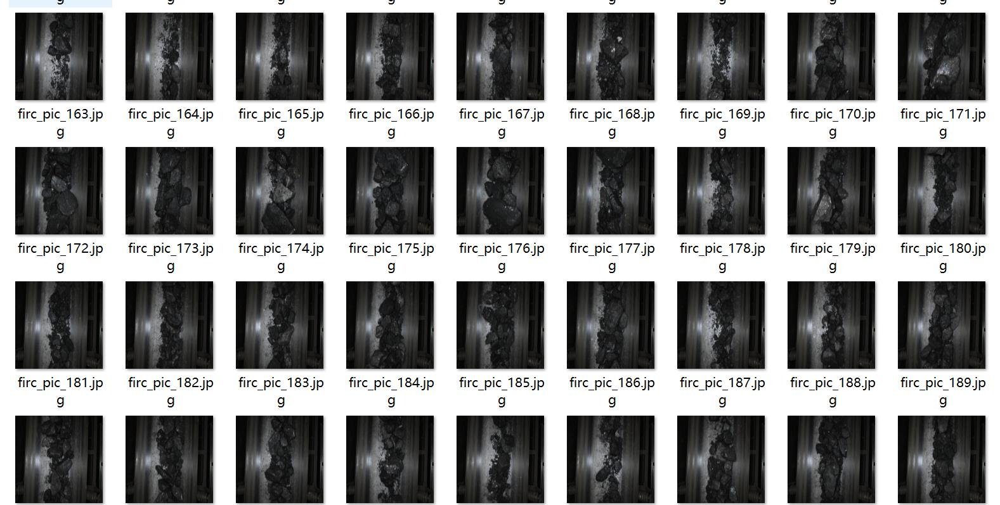
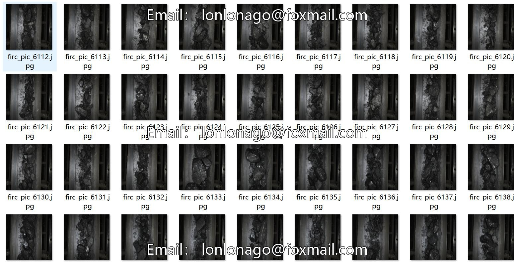
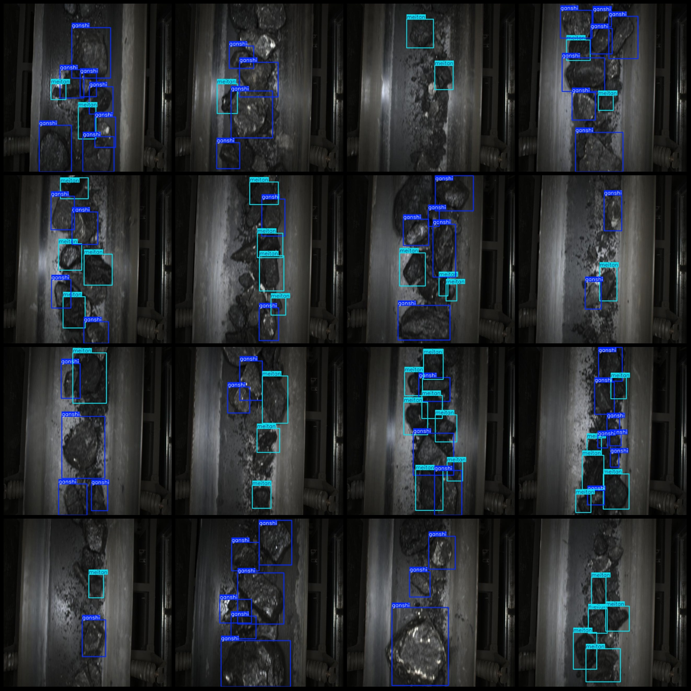
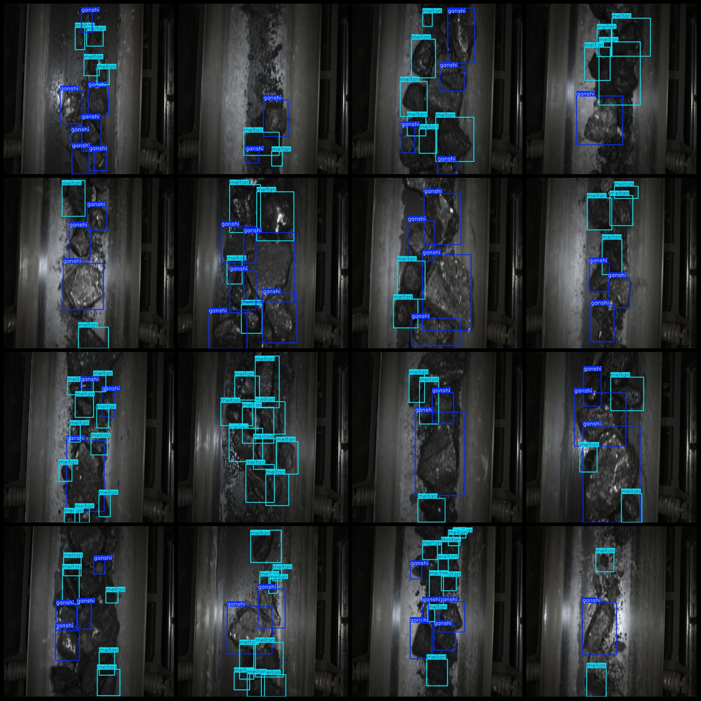

# Smart Mining Transporter Coal Gangue Detection Data Set (VOC+YOLO format, 7341 images in 3 categories)

Dataset format: Pascal VOC format + YOLO format (txt file without split path, only including jpg images and corresponding VOC format xml files and YOLO format txt files)
Number of images (jpg file count): 7341
Number of annotations (xml file count): 7341
Number of annotations (txt file count): 7341
Number of annotation categories: 3
Annotation category names (Note that the order of categories in YOLO format does not correspond to this, but is based on the labels folder "classes.txt"): ["ganshi", "hunhewu", "meitan"]
Number of boxes per category:
ganshi (Ganshi) boxes = 25498
hunhewu (Coal gangue mixture) boxes = 2
meitan (Coal) boxes = 26792
Total boxes: 52292
Number of images per category:
ganshi (Ganshi) images = 7020
hunhewu (Coal mixture) images = 1
meitan (Coal) images = 6884
Image resolution: 640x640
Annotation tool used: labelImg
Annotation rules: draw bounding box for each category
Important notice: The dataset does not have been divided into training, validation, or test sets; you need to do it yourself.
Special declaration: This dataset does not guarantee the accuracy of the trained model or weight files.
Image preview:
Annotation example:

## Images

Here is a pay link on Stripe ( https://buy.stripe.com/3cs8yP7sY87d0vu9AB ). Please contact me lonlonago@foxmail.com after funding $89, and I will send you a complete data files , thank you!

